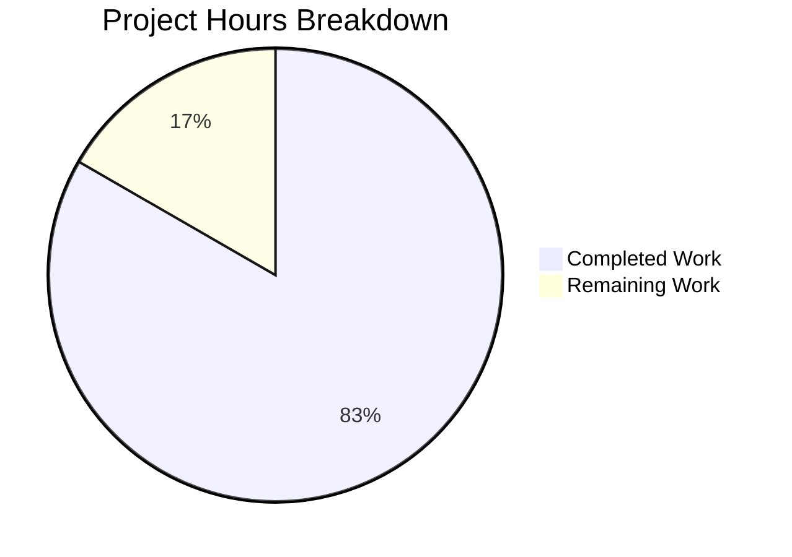

# Project Guide — 9Feb_1 Express.js Tutorial Server

## 1. Executive Summary

**Project Completion: 83% complete (5 hours completed out of 6 total hours)**

This project integrates the Express.js 5.2.1 web framework into a new Node.js tutorial server, implementing two HTTP GET endpoints: `GET /` returning `"Hello world"` and `GET /evening` returning `"Good evening"`. The project was built from an empty repository containing only a placeholder `README.md`.

**All four in-scope deliverables have been created, validated, and committed:**
1. `package.json` — Express.js 5.2.1 dependency and project metadata
2. `package-lock.json` — Full dependency tree locked (66 packages, 0 vulnerabilities)
3. `index.js` — Express.js application with both route handlers
4. `README.md` — Comprehensive project documentation

**Validation Results:** 100% pass rate across all gates — dependencies installed cleanly, syntax check passed, both endpoints return exact expected responses at runtime. Zero issues were found during validation; no fixes were required.

**Remaining Work:** 1 hour of human tasks remain — primarily code review, a minor README placeholder fix, and merge to main. No functional code changes are needed.

**Completion Calculation:**
- Completed: 5 hours (project setup, implementation, documentation, validation)
- Remaining: 1 hour (human review, placeholder fix, merge)
- Total: 6 hours
- Completion: 5 / 6 = 83%

---

## 2. Validation Results Summary

### 2.1 Environment
| Component | Version | Status |
|-----------|---------|--------|
| Node.js | 24.13.0 (Active LTS "Krypton") | ✅ Installed via nvm |
| npm | 11.6.2 | ✅ Bundled with Node.js |
| Express.js | 5.2.1 | ✅ Installed, 0 vulnerabilities |

### 2.2 Dependency Installation
- **Command:** `npm install`
- **Result:** 66 packages audited, 0 vulnerabilities
- **Express.js 5.2.1** correctly resolved and locked in `package-lock.json`

### 2.3 Compilation / Syntax Check
- **Command:** `node --check index.js`
- **Result:** ✅ Syntax validation passed with zero errors

### 2.4 Runtime Endpoint Verification
| Endpoint | Expected Response | Actual Response | Status |
|----------|-------------------|-----------------|--------|
| `GET /` | `Hello world` | `Hello world` | ✅ Pass |
| `GET /evening` | `Good evening` | `Good evening` | ✅ Pass |
| `GET /nonexistent` | 404 | 404 | ✅ Pass |

### 2.5 Tests
Testing frameworks are **explicitly out of scope** per Agent Action Plan section 0.6.2. Runtime endpoint verification confirms functional correctness of both endpoints.

### 2.6 Issues Resolved During Validation
**None** — all files were correctly implemented on the first pass. Zero compilation errors, zero runtime errors, zero dependency issues.

### 2.7 Git Status
- **Branch:** `blitzy-522525be-a60f-463e-a64a-7c8c889deae8`
- **Commits on branch:** 7
- **Working tree:** Clean (nothing to commit)
- **Files changed vs main:** 7 files, +1,667 lines added, -1 line removed

---

## 3. Hours Breakdown — Visual Representation



**Breakdown of Completed Work (5 hours):**
| Category | Hours | Details |
|----------|-------|---------|
| Project analysis and design | 1.0h | Requirements analysis, architecture decisions, dependency research |
| Project foundation setup | 0.75h | package.json creation, npm install, .gitignore |
| Core implementation | 1.0h | index.js Express.js server with two route handlers |
| Documentation | 1.0h | README.md rewrite with comprehensive sections |
| Validation and testing | 0.75h | Syntax checks, runtime endpoint verification, security audit |
| Git operations | 0.5h | Commit management, branch operations |
| **Total Completed** | **5.0h** | |

**Breakdown of Remaining Work (1 hour):**
| Category | Hours | Details |
|----------|-------|---------|
| README placeholder fix | 0.25h | Replace `<repository-url>` with actual URL |
| Code review and PR approval | 0.5h | Human review of all changes |
| Merge to main | 0.25h | Final merge and verification |
| **Total Remaining** | **1.0h** | |

---

## 4. Detailed Remaining Task Table

All remaining tasks are human-dependent and do not require additional code development. The sum of all task hours equals 1.0 hour, matching the "Remaining Work" in the pie chart above.

| # | Task | Priority | Severity | Hours | Action Steps |
|---|------|----------|----------|-------|--------------|
| 1 | Replace `<repository-url>` placeholder in README.md | Medium | Low | 0.25h | Open `README.md` line 24, replace `<repository-url>` with the actual Git repository URL for the clone command |
| 2 | Code review and pull request approval | High | Medium | 0.50h | Review all 4 in-scope files (`package.json`, `package-lock.json`, `index.js`, `README.md`), verify endpoint response strings match requirements, approve PR |
| 3 | Merge to main branch and verify | Medium | Low | 0.25h | Merge the PR to `main`, verify the merge commit, confirm `main` branch builds and runs correctly |
| | **Total Remaining Hours** | | | **1.00h** | |

---

## 5. Comprehensive Development Guide

### 5.1 System Prerequisites

| Requirement | Minimum | Recommended |
|-------------|---------|-------------|
| **Node.js** | >= 18.0.0 | 24.13.0 (Active LTS "Krypton") |
| **npm** | >= 9.0.0 | 11.6.2 (bundled with Node.js 24.13.0) |
| **Operating System** | Linux, macOS, or Windows | Any with Node.js support |
| **Disk Space** | ~50 MB | ~50 MB (including node_modules) |

Verify your Node.js and npm versions:

```bash
node --version
# Expected: v24.13.0 (or any version >= 18)

npm --version
# Expected: 11.6.2
```

### 5.2 Environment Setup

**Step 1 — Clone the repository:**

```bash
git clone <repository-url>
cd 9Feb_1
```

**Step 2 — Switch to the feature branch (if reviewing):**

```bash
git checkout blitzy-522525be-a60f-463e-a64a-7c8c889deae8
```

No environment variables, `.env` files, databases, or external services are required. This is a self-contained tutorial server.

### 5.3 Dependency Installation

**Step 3 — Install dependencies:**

```bash
npm install
```

**Expected output:**
```
added 66 packages, and audited 66 packages in Xs
found 0 vulnerabilities
```

**Verification — Confirm Express.js is installed:**

```bash
node -e "console.log(require('express/package.json').version)"
# Expected: 5.2.1
```

### 5.4 Application Startup

**Step 4 — Start the server:**

```bash
npm start
```

**Expected output:**
```
Server is running on port 3000
```

The server is now listening on `http://localhost:3000`. No background services, databases, or additional processes are required.

### 5.5 Verification Steps

**Step 5 — Test the endpoints:**

Open a new terminal and run:

```bash
# Test the root endpoint
curl http://localhost:3000/
# Expected response: Hello world

# Test the evening endpoint
curl http://localhost:3000/evening
# Expected response: Good evening
```

**Step 6 — Validate syntax (optional development check):**

```bash
node --check index.js
# Expected: No output (success), exit code 0
```

**Step 7 — Run security audit (optional):**

```bash
npm audit
# Expected: found 0 vulnerabilities
```

### 5.6 Example Usage

**Using curl:**
```bash
curl -i http://localhost:3000/
# HTTP/1.1 200 OK
# Content-Type: text/html; charset=utf-8
# ...
# Hello world

curl -i http://localhost:3000/evening
# HTTP/1.1 200 OK
# Content-Type: text/html; charset=utf-8
# ...
# Good evening
```

**Using a web browser:**
- Navigate to `http://localhost:3000/` → displays "Hello world"
- Navigate to `http://localhost:3000/evening` → displays "Good evening"

**Stopping the server:**
Press `Ctrl+C` in the terminal where the server is running.

### 5.7 Troubleshooting

| Issue | Cause | Resolution |
|-------|-------|------------|
| `Error: Cannot find module 'express'` | Dependencies not installed | Run `npm install` |
| `EADDRINUSE: address already in use :::3000` | Port 3000 already occupied | Kill the existing process or change the port in `index.js` |
| `node: command not found` | Node.js not installed or not in PATH | Install Node.js >= 18 from nodejs.org |
| `npm WARN engine` | Node.js version below 18 | Upgrade Node.js to >= 18 (recommended: 24.13.0) |

---

## 6. Feature Completion Assessment

### 6.1 Requirements vs Implementation Matrix

| Requirement (from Agent Action Plan) | Status | Evidence |
|---------------------------------------|--------|----------|
| Initialize `package.json` with Express.js 5.2.1 | ✅ Complete | `express: "5.2.1"` in dependencies, exact version pinned |
| Auto-generate `package-lock.json` | ✅ Complete | 827-line lockfile with full dependency tree |
| Create `index.js` Express.js entry point | ✅ Complete | 28-line file with Express app, two routes, server listener |
| GET `/` returns exactly `"Hello world"` | ✅ Verified | Runtime curl test confirms exact string match |
| GET `/evening` returns exactly `"Good evening"` | ✅ Verified | Runtime curl test confirms exact string match |
| Server listens on port 3000 | ✅ Verified | `const port = 3000` and confirmed at runtime |
| CommonJS module system (`require()`) | ✅ Complete | `const express = require('express')` on line 5 |
| Single-file server architecture | ✅ Complete | All logic in `index.js`, no additional source files |
| Rewrite `README.md` with documentation | ✅ Complete | 90-line comprehensive README with all required sections |
| Backward compatibility (Hello world preserved) | ✅ Verified | GET `/` returns `"Hello world"` unchanged |

**Result: 10/10 requirements implemented and verified (100% functional completeness)**

### 6.2 Files Created/Modified

| File | Action | Lines | Status |
|------|--------|-------|--------|
| `.gitignore` | Created | 1 | ✅ Committed |
| `package.json` | Created | 18 | ✅ Committed |
| `package-lock.json` | Auto-generated | 827 | ✅ Committed |
| `index.js` | Created | 28 | ✅ Committed |
| `README.md` | Modified | 90 (+89, -1) | ✅ Committed |

### 6.3 Git Commit History

| Commit | Author | Message |
|--------|--------|---------|
| `13b36e6` | Blitzy Setup Agent | chore: add .gitignore to exclude node_modules |
| `407940e` | Blitzy Setup Agent | chore: add package.json with express@5.2.1 dependency |
| `a84f8c1` | Blitzy Setup Agent | chore: add package-lock.json for deterministic dependency resolution |
| `9eda530` | Blitzy Setup Agent | docs: rewrite README.md with comprehensive project documentation |
| `119e97b` | Blitzy Setup Agent | Create index.js - Express.js tutorial server with Hello world and Good evening endpoints |
| `46ced2f` | Blitzy Agent | Adding Blitzy Project Guide |
| `801b96b` | Blitzy Agent | Adding Blitzy Technical Specifications |

---

## 7. Risk Assessment

All identified risks are **Low severity** given the tutorial nature and narrow scope of this project.

### 7.1 Technical Risks

| Risk | Severity | Likelihood | Mitigation |
|------|----------|------------|------------|
| No error handling middleware | Low | Low | Express.js 5.x includes built-in error handling; custom middleware is out of scope for tutorial |
| Hardcoded port 3000 | Low | Low | Acceptable for tutorial; can be made configurable via environment variable if needed later |
| No graceful shutdown handling | Low | Low | Tutorial scope; `Ctrl+C` is sufficient for development use |

### 7.2 Security Risks

| Risk | Severity | Likelihood | Mitigation |
|------|----------|------------|------------|
| No CORS configuration | Low | Low | Out of scope; no cross-origin requests expected for tutorial |
| No rate limiting | Low | Low | Out of scope; tutorial server not exposed to public traffic |
| Express default `X-Powered-By` header | Low | Low | Exposes Express usage; can be disabled with `app.disable('x-powered-by')` if needed |

### 7.3 Operational Risks

| Risk | Severity | Likelihood | Mitigation |
|------|----------|------------|------------|
| No process manager | Low | Low | Out of scope; `npm start` sufficient for tutorial use |
| No health check endpoint | Low | Low | Out of scope; server availability verified by endpoint responses |
| No logging framework | Low | Low | `console.log` is sufficient for tutorial; structured logging out of scope |

### 7.4 Integration Risks

| Risk | Severity | Likelihood | Mitigation |
|------|----------|------------|------------|
| No external service dependencies | None | N/A | Self-contained project with no external integrations |
| Node.js version compatibility | Low | Low | Express 5.2.1 requires Node.js >= 18; documented in README prerequisites |

**Overall Risk Level: Low** — The project is a self-contained tutorial with no external dependencies, no database, no authentication, and no deployment infrastructure. All identified risks are inherent to the intentionally minimal tutorial scope.

---

## 8. Architecture Overview

```
9Feb_1/
├── .gitignore           # Excludes node_modules/ from version control
├── index.js             # Express.js application entry point (28 lines)
│   ├── GET /            # Returns "Hello world"
│   └── GET /evening     # Returns "Good evening"
├── package.json         # Project manifest, Express.js 5.2.1 dependency
├── package-lock.json    # Locked dependency tree (66 packages)
├── README.md            # Comprehensive project documentation
└── node_modules/        # Installed dependencies (not tracked in git)
```

**Request Flow:**
```
Client HTTP Request → Express.js Router → Route Handler → res.send() → HTTP Response
```

---

## 9. Pre-Submission Consistency Checklist

- [x] Calculated completion % using hours formula: 5 / (5 + 1) = 83%
- [x] Verified Executive Summary states this exact %: "83% complete (5 hours completed out of 6 total hours)"
- [x] Verified pie chart uses exact completed/remaining hours: "Completed Work: 5" and "Remaining Work: 1"
- [x] Verified task table sums to exact remaining hours: 0.25 + 0.50 + 0.25 = 1.0h ✓
- [x] Searched report for any % or hour mentions — all match
- [x] No conflicting or ambiguous statements exist
- [x] Shown the calculation formula with actual numbers