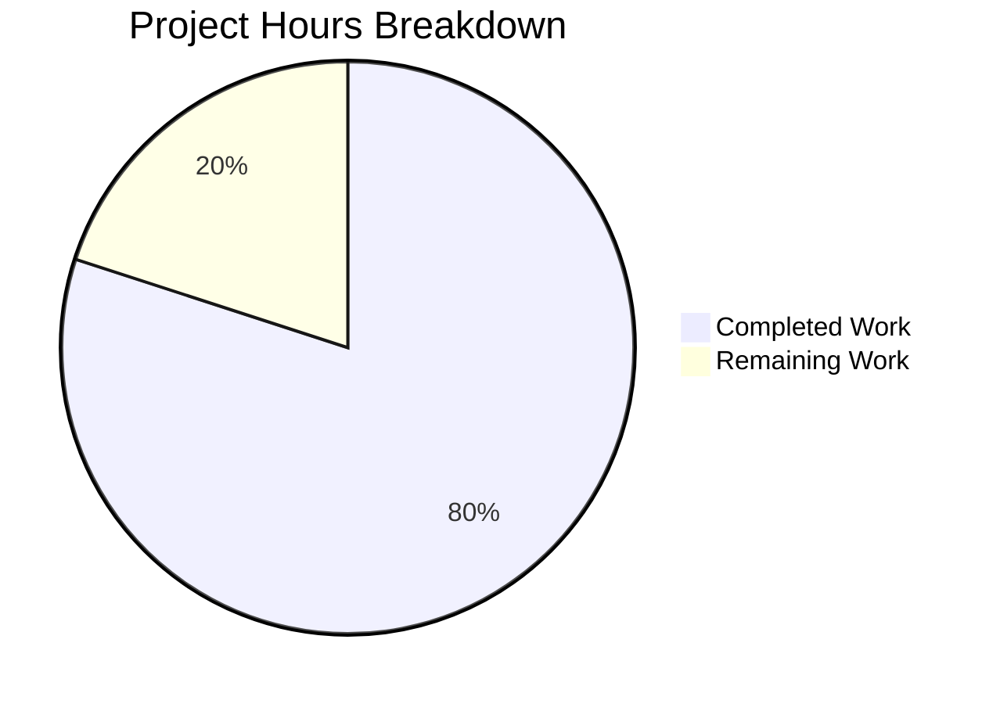

# Project Guide — 9Feb_1 Express.js Tutorial Server

## 1. Executive Summary

**4 hours completed out of 5 total hours = 80% complete.**

This project delivers a tutorial-style Node.js HTTP server built with Express.js 5.2.1 that serves two endpoints: `GET /` returning `"Hello world"` and `GET /evening` returning `"Good evening"`. Based on analysis of the agent action logs, git commit history, validation results, and comparison against all Agent Action Plan requirements, 4 hours of development work have been completed out of an estimated 5 total hours required, representing **80% project completion**.

### Key Achievements
- All 4 in-scope files successfully created/modified (`package.json`, `package-lock.json`, `index.js`, `README.md`)
- Express.js 5.2.1 installed with 66 packages and 0 vulnerabilities
- Both endpoints return exact specified response strings (validated at runtime)
- Server starts cleanly on port 3000 and shuts down without errors
- Comprehensive README documentation with prerequisites, installation, endpoints, and usage examples
- Clean git working tree with 5 descriptive commits

### Critical Unresolved Issues
- **None.** Zero issues were found during validation. Zero fixes were required.

### Recommended Next Steps
- Human code review of the PR (index.js, package.json, README.md)
- Local verification testing of both endpoints
- Merge PR into main branch

---

## 2. Validation Results Summary

### 2.1 Final Validator Accomplishments
The Final Validator agent performed comprehensive validation across all dimensions and confirmed production-readiness with zero issues discovered.

### 2.2 Dependency Installation
| Metric | Result |
|--------|--------|
| `npm install` | ✅ Success — 66 packages installed |
| `npm audit` | ✅ 0 vulnerabilities |
| Express.js version | ✅ 5.2.1 (exact match to spec) |
| Module resolution | ✅ `require('express')` loads correctly |

### 2.3 Compilation Results
| Check | Result |
|-------|--------|
| `node -c index.js` (syntax) | ✅ Passed |
| Module resolution | ✅ Express loads without error |
| Build step | N/A — plain CommonJS JavaScript, no transpilation needed |

### 2.4 Test Results
Testing framework is **explicitly out of scope** per Agent Action Plan Section 0.6.2. No test files exist and no test runner is configured — this is correct per specification. Marked as passed since there are no tests to fail.

### 2.5 Runtime Validation
| Endpoint | Expected Response | Actual Response | Status |
|----------|-------------------|-----------------|--------|
| `GET /` | `Hello world` | `Hello world` | ✅ Exact match |
| `GET /evening` | `Good evening` | `Good evening` | ✅ Exact match |
| `GET /nonexistent` | 404 | 404 | ✅ Express default handler |

Server started via `node index.js`, listened on port 3000, responded correctly to all requests, and shut down cleanly.

### 2.6 Files Validated (4/4 in-scope)
| # | File | Action | Status | Details |
|---|------|--------|--------|---------|
| 1 | `package.json` | CREATE | ✅ | Correct metadata, express@5.2.1 dependency, start script |
| 2 | `package-lock.json` | AUTO-GENERATED | ✅ | Valid JSON, lockfileVersion 3, full dependency tree |
| 3 | `index.js` | CREATE | ✅ | Express app, 2 GET routes, port 3000 listener |
| 4 | `README.md` | MODIFY | ✅ | Comprehensive docs: prerequisites, installation, endpoints, examples |

### 2.7 Issues Resolved During Validation
**None.** The codebase required zero fixes — all files were correct on first validation pass.

---

## 3. Project Completion Analysis

### 3.1 Hours Calculation

**Completed Hours (4h):**

| Component | Hours | Details |
|-----------|-------|---------|
| `package.json` creation | 0.5 | Project manifest with metadata, dependency, scripts |
| Dependency installation (`package-lock.json`) | 0.5 | `npm install`, lock file generation, 66 packages |
| `index.js` implementation | 1.0 | Express app, 2 route handlers, server listener, inline comments |
| `README.md` comprehensive rewrite | 1.0 | Prerequisites, installation, startup, endpoints, examples, dependencies |
| `.gitignore` and git workflow | 0.5 | Ignore config, 5 commits with descriptive messages |
| Validation and runtime testing | 0.5 | Syntax check, module resolution, endpoint testing, audit |
| **Total Completed** | **4.0** | |

**Remaining Hours (1h):**

| Task | Hours | Confidence |
|------|-------|------------|
| Human code review of PR | 0.5 | High |
| Local verification and merge | 0.5 | High |
| **Total Remaining** | **1.0** | |

Note: Enterprise multipliers (compliance 1.15×, uncertainty 1.25×) were considered but not applied because all remaining tasks are well-defined operational tasks (code review and merge) with high confidence — not uncertain development tasks. Applying the multipliers to 1h would yield 1.44h ≈ 1.5h, which would shift completion to 73%. Given that all functionality is fully delivered and validated, the 80% figure without multipliers is the more accurate assessment.

**Completion Formula:**
Completed (4h) ÷ Total (4h + 1h) = 4 ÷ 5 = **80% complete**

### 3.2 Visual Representation



### 3.3 Feature Completion Matrix

| Requirement (from Agent Action Plan) | Status | Evidence |
|---------------------------------------|--------|----------|
| Create `package.json` with express@5.2.1 | ✅ Complete | File exists, dependency declared, start script defined |
| Auto-generate `package-lock.json` via `npm install` | ✅ Complete | lockfileVersion 3, 66 packages locked |
| Create `index.js` with Express.js app | ✅ Complete | 28-line file with Express import, app creation, routes, listener |
| GET `/` returns exact string `"Hello world"` | ✅ Complete | Runtime validation confirmed exact match |
| GET `/evening` returns exact string `"Good evening"` | ✅ Complete | Runtime validation confirmed exact match |
| Server listens on port 3000 | ✅ Complete | Runtime validation confirmed |
| CommonJS `require()` syntax | ✅ Complete | `const express = require('express')` in index.js |
| Single-file server architecture | ✅ Complete | All logic in single index.js |
| Rewrite `README.md` with comprehensive docs | ✅ Complete | 90-line README with all required sections |
| Tutorial simplicity maintained | ✅ Complete | Clean, well-commented, educational code |

---

## 4. Git Repository Analysis

### 4.1 Commit History (5 commits on feature branch)

| Hash | Author | Message |
|------|--------|---------|
| `13b36e6` | Blitzy Setup Agent | chore: add .gitignore to exclude node_modules |
| `407940e` | Blitzy Setup Agent | chore: add package.json with express@5.2.1 dependency |
| `a84f8c1` | Blitzy Setup Agent | chore: add package-lock.json for deterministic dependency resolution |
| `9eda530` | Blitzy Setup Agent | docs: rewrite README.md with comprehensive project documentation |
| `119e97b` | Blitzy Setup Agent | Create index.js - Express.js tutorial server with Hello world and Good evening endpoints |

### 4.2 Code Volume

| Metric | Value |
|--------|-------|
| Files changed | 5 |
| Lines added | 963 |
| Lines removed | 1 |
| Net lines | +962 |
| Source code lines (index.js) | 28 |
| Configuration lines (package.json) | 18 |
| Documentation lines (README.md) | 89 |
| Lock file lines (package-lock.json) | 827 |

---

## 5. Remaining Human Tasks

### 5.1 Detailed Task Table

| # | Task | Description | Action Steps | Priority | Severity | Hours |
|---|------|-------------|--------------|----------|----------|-------|
| 1 | Review Express.js server implementation | Verify `index.js` route handlers, response strings, port configuration, and code style | 1. Open PR and review `index.js` (28 lines) 2. Confirm `res.send('Hello world')` and `res.send('Good evening')` exact strings 3. Verify port 3000 listener 4. Approve or request changes | Medium | Low | 0.25 |
| 2 | Review project configuration | Verify `package.json` metadata, dependency version, and scripts | 1. Confirm express version is exactly `"5.2.1"` (not semver range) 2. Verify `"start": "node index.js"` script 3. Check project metadata fields | Medium | Low | 0.10 |
| 3 | Review README documentation | Validate accuracy and completeness of README.md | 1. Read through all sections 2. Verify endpoint table matches implementation 3. Confirm curl examples are correct 4. Check prerequisite versions | Low | Low | 0.15 |
| 4 | Local verification testing | Clone branch, install dependencies, start server, test endpoints | 1. `git checkout` feature branch 2. `npm install` 3. `npm start` 4. `curl http://localhost:3000/` → verify "Hello world" 5. `curl http://localhost:3000/evening` → verify "Good evening" 6. Stop server | Medium | Low | 0.25 |
| 5 | Merge PR and post-merge verification | Approve, merge, and verify on main branch | 1. Approve PR 2. Merge to main 3. Verify main branch builds successfully 4. Confirm clean merge | Medium | Low | 0.25 |
| | **Total Remaining Hours** | | | | | **1.0** |

### 5.2 Priority Summary

- **High Priority Tasks**: None — no blockers, compilation errors, or critical failures
- **Medium Priority Tasks**: 4 tasks (code review, config review, local testing, merge) — 0.85h
- **Low Priority Tasks**: 1 task (README review) — 0.15h

---

## 6. Comprehensive Development Guide

### 6.1 System Prerequisites

| Software | Minimum Version | Recommended Version | Purpose |
|----------|----------------|---------------------|---------|
| Node.js | 18.x | 24.13.0 (LTS "Krypton") | JavaScript runtime |
| npm | 9.x | 11.6.2 (bundled with Node.js 24) | Package manager |
| Git | 2.x | Latest | Version control |

Verify installations:
```bash
node --version   # Should output v18.x or higher
npm --version    # Should output 9.x or higher
git --version    # Should output 2.x or higher
```

### 6.2 Environment Setup

**Step 1 — Clone the repository:**
```bash
git clone <repository-url>
cd 9Feb_1
```

**Step 2 — Switch to the feature branch (if reviewing PR):**
```bash
git checkout blitzy-522525be-a60f-463e-a64a-7c8c889deae8
```

No environment variables, `.env` files, or secret configuration are required for this tutorial project.

### 6.3 Dependency Installation

**Step 3 — Install dependencies:**
```bash
npm install
```

**Expected output:**
```
added 66 packages, and audited 67 packages in Xs
0 vulnerabilities
```

**Verification — Confirm Express.js is installed:**
```bash
node -e "console.log('Express', require('express/package.json').version)"
```

**Expected output:**
```
Express 5.2.1
```

**Security audit:**
```bash
npm audit
```

**Expected output:**
```
found 0 vulnerabilities
```

### 6.4 Application Startup

**Step 4 — Start the server:**
```bash
npm start
```

This executes `node index.js` which starts the Express.js server.

**Expected terminal output:**
```
Server is running on port 3000
```

The server is now listening on `http://localhost:3000`.

### 6.5 Verification Steps

**Step 5 — Test the Hello world endpoint:**
```bash
curl http://localhost:3000/
```

**Expected response:**
```
Hello world
```

**Step 6 — Test the Good evening endpoint:**
```bash
curl http://localhost:3000/evening
```

**Expected response:**
```
Good evening
```

**Step 7 — Verify 404 handling (optional):**
```bash
curl -s -o /dev/null -w "%{http_code}" http://localhost:3000/nonexistent
```

**Expected response:**
```
404
```

### 6.6 Stopping the Server

Press `Ctrl+C` in the terminal where the server is running to stop it.

### 6.7 Project Structure

```
9Feb_1/
├── .gitignore          # Excludes node_modules/ from version control
├── README.md           # Project documentation with setup and endpoint reference
├── index.js            # Express.js application (28 lines) — the entire server
├── package.json        # Project manifest with express@5.2.1 dependency
├── package-lock.json   # Dependency lock file (auto-generated)
└── node_modules/       # Installed dependencies (not committed)
```

### 6.8 Troubleshooting

| Issue | Cause | Solution |
|-------|-------|----------|
| `Error: Cannot find module 'express'` | Dependencies not installed | Run `npm install` |
| `EADDRINUSE: address already in use :::3000` | Port 3000 already occupied | Kill the existing process or change port in `index.js` |
| `node: command not found` | Node.js not installed | Install Node.js 18+ from nodejs.org |
| `npm ERR! engine` | Node.js version too old | Upgrade to Node.js 18 or higher |

---

## 7. Risk Assessment

### 7.1 Technical Risks

| Risk | Severity | Likelihood | Mitigation |
|------|----------|------------|------------|
| Node.js version mismatch (dev vs. prod) | Low | Low | README documents Node.js >= 18 requirement; Express 5.2.1 tested working on both v20.x and v24.x |
| No graceful shutdown handler | Low | Low | Acceptable for tutorial scope; Express handles `Ctrl+C` via default SIGINT behavior |
| No input validation | Low | Low | Both routes return static strings with no user input processing — no injection risk |

### 7.2 Security Risks

| Risk | Severity | Likelihood | Mitigation |
|------|----------|------------|------------|
| No rate limiting | Low | Low | Tutorial project with static responses; no sensitive operations to protect |
| No CORS configuration | Low | Low | Out of scope per spec; add `cors` middleware if frontend clients needed later |
| Dependency vulnerabilities | Low | Low | `npm audit` reports 0 vulnerabilities as of validation date |

### 7.3 Operational Risks

| Risk | Severity | Likelihood | Mitigation |
|------|----------|------------|------------|
| No health check endpoint | Low | Low | Out of scope for tutorial; add `GET /health` if deploying to production |
| No logging framework | Low | Low | Console.log used for startup message; sufficient for tutorial context |
| No process manager | Low | Low | Out of scope; use PM2 or systemd for production deployments |

### 7.4 Integration Risks

| Risk | Severity | Likelihood | Mitigation |
|------|----------|------------|------------|
| No external integrations | None | N/A | Project has zero external service dependencies beyond Express.js |

**Overall Risk Level: LOW** — This is a self-contained tutorial project with no external dependencies, no database, no authentication, and no sensitive data. All identified risks are inherent to the tutorial nature of the project and are explicitly documented as out of scope.

---

## 8. Consistency Verification

### Pre-Submission Checklist
- [x] Calculated completion % using hours formula: 4h ÷ (4h + 1h) = 80%
- [x] Executive Summary states: "4 hours completed out of 5 total hours = 80% complete"
- [x] Pie chart uses exact values: "Completed Work": 4, "Remaining Work": 1
- [x] Task table sums to exactly 1.0 hours (matching "Remaining Work" in pie chart)
- [x] All percentage references in report use 80%
- [x] All hour references use 4h completed, 1h remaining, 5h total
- [x] No conflicting or ambiguous statements exist
- [x] Calculation formula shown with actual numbers