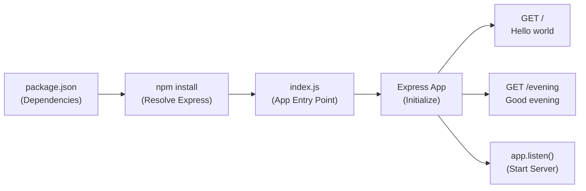

# Technical Specification

# 0. Agent Action Plan

## 0.1 Intent Clarification

### 0.1.1 Core Feature Objective

Based on the prompt, the Blitzy platform understands that the new feature requirement is to **integrate the Express.js web framework into an existing Node.js tutorial server project and add a new HTTP endpoint**. Specifically:

- **Establish a Node.js HTTP server foundation**: The existing product is described as a tutorial-style Node.js server that hosts a single endpoint returning the response `"Hello world"`. Since the repository currently contains only a `README.md` placeholder, the foundational server module using Node.js's built-in `http` module must be created as the baseline "existing product."
- **Integrate Express.js into the project**: The Express.js framework must be added as a project dependency, replacing or augmenting the native `http` module approach with Express's routing and middleware capabilities.
- **Add a new endpoint returning `"Good evening"`**: A second HTTP endpoint must be created using Express.js that returns the plain-text response `"Good evening"` to incoming requests.

**Implicit Requirements Detected:**

- A `package.json` manifest must be initialized to manage the Express.js dependency, since none exists in the repository today.
- The project requires Node.js runtime compatibility — Express.js 5.2.1 requires Node.js >= 18, and the recommended runtime is Node.js 24.13.0 (Active LTS "Krypton").
- The original `"Hello world"` endpoint must remain functional after Express.js integration, preserving backward compatibility.
- The `README.md` must be updated to document the new project structure, setup instructions, and available endpoints.

### 0.1.2 Special Instructions and Constraints

- **Tutorial Context**: The user explicitly states this is a tutorial project. Implementation should prioritize clarity, simplicity, and educational value over production-grade complexity.
- **Framework Integration Pattern**: Express.js should be introduced as the primary routing framework, consolidating both the existing `"Hello world"` endpoint and the new `"Good evening"` endpoint under Express's routing system.
- **Maintain Backward Compatibility**: The original `"Hello world"` response must remain accessible after the Express.js migration — the endpoint behavior must not change.
- **No Figma Attachments**: No UI design files or Figma URLs were provided. This feature is purely backend/server-side.
- **No Environment Variables or Secrets**: The user has not specified any environment variables or secrets for this feature.

### 0.1.3 Technical Interpretation

These feature requirements translate to the following technical implementation strategy:

- To **establish the baseline server**, we will create an `index.js` entry point file using Node.js's built-in `http` module that serves one GET endpoint returning `"Hello world"` — this represents the pre-existing tutorial server.
- To **integrate Express.js**, we will initialize a `package.json` project manifest via `npm init`, install `express@5.2.1` as a dependency, and refactor the server entry point to use Express's `app.get()` routing API instead of raw `http.createServer()`.
- To **add the new endpoint**, we will register an additional Express route (e.g., `app.get('/evening', ...)`) that responds with the plain-text string `"Good evening"`.
- To **document the project**, we will update `README.md` with project description, setup instructions, dependency information, and endpoint documentation.

## 0.2 Repository Scope Discovery

### 0.2.1 Comprehensive File Analysis

The current repository is in its earliest inception phase, containing a single file. The complete inventory of the existing repository and all files requiring modification or creation is documented below.

**Existing Files Requiring Modification:**

| File Path | Current State | Required Changes |
|---|---|---|
| `README.md` | Contains only the heading `# 9Feb_1` (1 line, 8 bytes) | Rewrite with project description, setup instructions, dependency list, endpoint documentation, and usage examples |

**Integration Point Discovery:**

Since the repository is at project inception (no source code, no configuration files, no dependency manifests), the integration effort centers on creating the full Node.js + Express.js project structure from scratch. The key integration points are:

- **Server entry point**: A new `index.js` file serving as the Express.js application root, binding both the `"Hello world"` and `"Good evening"` routes
- **Dependency manifest**: A new `package.json` declaring the Express.js dependency and project metadata
- **Lock file**: A generated `package-lock.json` to pin exact dependency versions for reproducible installs

### 0.2.2 Web Search Research Conducted

The following research was performed to inform implementation decisions:

- **Express.js latest stable version**: Confirmed Express.js 5.2.1 as the latest release on npm, requiring Node.js >= 18
- **Node.js LTS schedule**: Confirmed Node.js 24.x (codename "Krypton") as the current Active LTS release line, with Node.js 24.13.0 as the latest point release
- **Express.js v5 changes**: Express v5 focuses on simplified codebase, improved security, dropped support for Node.js versions before v18, updated routing with `path-to-regexp@8.x`, and native Promise/async middleware support
- **Express.js best practices**: Pin dependency versions with lockfiles, run `npm audit`, and prefer well-maintained libraries

### 0.2.3 New File Requirements

**New source files to create:**

| File Path | Purpose | Description |
|---|---|---|
| `index.js` | Server entry point | Express.js application that registers the `"Hello world"` and `"Good evening"` endpoints, configures the server, and starts listening on a designated port |

**New configuration files to create:**

| File Path | Purpose | Description |
|---|---|---|
| `package.json` | Dependency manifest | Project metadata including name, version, description, main entry point, scripts (start), and Express.js dependency declaration |
| `package-lock.json` | Dependency lock file | Auto-generated by `npm install` — pins exact dependency versions for deterministic installs across environments |

**New documentation files (via modification):**

| File Path | Purpose | Description |
|---|---|---|
| `README.md` | Project documentation | Updated with comprehensive project overview, installation steps, available endpoints, and usage instructions |

## 0.3 Dependency Inventory

### 0.3.1 Private and Public Packages

All packages required for this feature addition are public and sourced from the npm registry. No private packages are needed.

| Registry | Package Name | Version | Purpose |
|---|---|---|---|
| npmjs.com | `express` | 5.2.1 | Fast, unopinionated, minimalist web framework for Node.js — provides HTTP routing, middleware, and request/response handling for the tutorial server |

**Runtime Dependency:**

| Runtime | Version | Source | Purpose |
|---|---|---|---|
| Node.js | 24.13.0 (LTS "Krypton") | nodejs.org | JavaScript runtime environment — Active LTS release, satisfies Express.js engine requirement of `>= 18` |
| npm | 11.6.2 | Bundled with Node.js | Package manager for installing and managing the Express.js dependency |

**Version Verification:**

- Express.js 5.2.1 is confirmed as the latest stable release on npm as of February 2026.
- Node.js 24.13.0 is confirmed as the latest point release in the Node.js 24.x Active LTS line.
- Express.js 5.2.1 declares an engine requirement of `node >= 18`; Node.js 24.13.0 satisfies this constraint.

### 0.3.2 Dependency Updates

Since the repository currently has no dependency manifest or source files, there are no existing imports or external references to update. All dependency work is net-new creation.

**Import Statements to Establish:**

- `index.js` — will require a single import of the Express.js module:
  ```javascript
  const express = require('express');
  ```

**Configuration Files to Create:**

| File | Change Type | Details |
|---|---|---|
| `package.json` | CREATE | Declare `express@5.2.1` under `dependencies`, set `main` to `index.js`, define `start` script as `node index.js` |
| `package-lock.json` | AUTO-GENERATED | Created automatically by `npm install` — locks the full Express.js dependency tree including transitive dependencies |

**No Build Files Required:**

This tutorial project uses plain JavaScript (CommonJS) and does not require a build step, transpilation, or bundling. No `webpack`, `babel`, `typescript`, or similar tooling is necessary.

## 0.4 Integration Analysis

### 0.4.1 Existing Code Touchpoints

Since the repository contains only `README.md` with no source code, configuration files, or dependency manifests, there are no existing code touchpoints to modify. All integration work involves creating new files and establishing the project foundation.

**Direct Modifications Required:**

| File | Modification | Details |
|---|---|---|
| `README.md` | Rewrite content | Replace the single-line heading `# 9Feb_1` with comprehensive project documentation including description, setup instructions, endpoint reference, and usage examples |

### 0.4.2 New Integration Points to Establish

The following integration points must be created from scratch to enable the Express.js feature:

**Server Initialization Flow:**



**Application Architecture Integration Points:**

- **Express Application Instance** (`index.js`): Central integration point where the Express app is instantiated, routes are registered, and the server is started
- **Route: GET `/`** (`index.js`): The root endpoint handler that responds with `"Hello world"` — represents the original tutorial endpoint migrated to Express
- **Route: GET `/evening`** (`index.js`): The new endpoint handler that responds with `"Good evening"` — the new feature being added
- **Server Listener** (`index.js`): The `app.listen()` call that binds the Express server to a port (default `3000`) and begins accepting HTTP connections

### 0.4.3 Dependency Injection and Wiring

This tutorial project follows a simple, flat architecture with no dependency injection container or service registry. All wiring is accomplished through direct module imports within the single `index.js` file:

- Express module is imported via `require('express')`
- Routes are registered directly on the Express application instance
- No database, schema, or migration changes are required
- No middleware or interceptors beyond Express's built-in capabilities are needed

## 0.5 Technical Implementation

### 0.5.1 File-by-File Execution Plan

Every file listed below MUST be created or modified as part of this feature addition. Files are grouped by priority and dependency order.

**Group 1 — Project Foundation:**

| Action | File | Purpose |
|---|---|---|
| CREATE | `package.json` | Initialize the Node.js project manifest with project metadata, the Express.js dependency (`express@5.2.1`), and npm scripts (`start: node index.js`) |
| AUTO-GENERATED | `package-lock.json` | Generated by `npm install` to lock the entire dependency tree for reproducible builds |

**Group 2 — Core Feature File:**

| Action | File | Purpose |
|---|---|---|
| CREATE | `index.js` | Implement the Express.js application with two route handlers: GET `/` returning `"Hello world"` and GET `/evening` returning `"Good evening"`, then start the server on port 3000 |

**Group 3 — Documentation:**

| Action | File | Purpose |
|---|---|---|
| MODIFY | `README.md` | Rewrite with project overview, prerequisites (Node.js >= 18), installation instructions (`npm install`), startup command (`npm start`), and endpoint reference table |

### 0.5.2 Implementation Approach per File

**Step 1 — Establish project foundation by creating `package.json`:**

The `package.json` file defines the project identity and declares Express.js as the sole runtime dependency. It includes a `start` script for convenient server launch.

```json
{ "name": "9feb_1", "main": "index.js",
  "dependencies": { "express": "5.2.1" } }
```

**Step 2 — Implement the Express.js server in `index.js`:**

The `index.js` file creates an Express application, registers two GET routes, and starts listening. The root route (`/`) returns `"Hello world"` to represent the original tutorial endpoint, and the new route (`/evening`) returns `"Good evening"` as the added feature.

```javascript
const express = require('express');
const app = express();
```

**Step 3 — Update documentation in `README.md`:**

The `README.md` is rewritten to provide a complete project overview, list prerequisites, detail installation and startup steps, and describe each available endpoint with expected responses.

### 0.5.3 User Interface Design

No user interface design is applicable for this feature. The project is a backend Node.js server with HTTP API endpoints only. No Figma screens or URLs were provided by the user.

## 0.6 Scope Boundaries

### 0.6.1 Exhaustively In Scope

The following files and artifacts are exhaustively within the scope of this feature addition:

**Source Files:**

| Pattern / Path | Scope Description |
|---|---|
| `index.js` | Express.js application entry point — create with two route handlers (GET `/` → `"Hello world"`, GET `/evening` → `"Good evening"`) and server listener on port 3000 |

**Configuration Files:**

| Pattern / Path | Scope Description |
|---|---|
| `package.json` | Project manifest — create with project metadata, Express.js 5.2.1 dependency, and `start` script |
| `package-lock.json` | Dependency lock file — auto-generated by `npm install` to pin the full dependency tree |

**Documentation Files:**

| Pattern / Path | Scope Description |
|---|---|
| `README.md` | Project documentation — rewrite with description, prerequisites, installation guide, startup instructions, and endpoint reference |

**Complete File Inventory (4 total):**

| # | File | Action | Category |
|---|---|---|---|
| 1 | `package.json` | CREATE | Configuration |
| 2 | `package-lock.json` | AUTO-GENERATED | Configuration |
| 3 | `index.js` | CREATE | Source Code |
| 4 | `README.md` | MODIFY | Documentation |

### 0.6.2 Explicitly Out of Scope

The following items are explicitly excluded from this feature addition:

- **Database integration** — No database, ORM, or data persistence layer is required for this tutorial server
- **Authentication and authorization** — No user auth, tokens, or session management
- **Testing framework** — No unit tests, integration tests, or test runners (e.g., Jest, Mocha) — this is a minimal tutorial project
- **TypeScript migration** — The project uses plain JavaScript (CommonJS); no TypeScript configuration or compilation
- **Containerization** — No `Dockerfile`, `docker-compose.yml`, or container orchestration
- **CI/CD pipeline** — No `.github/workflows/`, `.gitlab-ci.yml`, or deployment automation
- **Environment variable management** — No `.env` files, `dotenv`, or runtime configuration beyond default port
- **Middleware** — No custom middleware, logging frameworks, error handlers, or CORS configuration beyond Express defaults
- **Frontend/UI layer** — No HTML templates, static file serving, or client-side rendering
- **Performance optimization** — No clustering, load balancing, or caching
- **Additional endpoints** — Only the two specified endpoints (`"Hello world"` and `"Good evening"`) are in scope
- **Production deployment** — No process managers (PM2), reverse proxies (Nginx), or production hardening
- **Refactoring unrelated code** — No changes to any files or modules outside the four listed in scope

## 0.7 Rules for Feature Addition

### 0.7.1 Feature-Specific Rules and Requirements

The user has not explicitly emphasized any special rules, conventions, or constraints beyond the core feature request. The following rules are derived from the user's stated intent and the tutorial nature of the project:

- **Tutorial Simplicity**: The implementation must remain simple and educational. Avoid over-engineering with patterns like dependency injection, service layers, or factory functions that would obscure the Express.js fundamentals being demonstrated.
- **Exact Response Strings**: The endpoint responses must match the user's specified strings exactly:
  - GET `/` must return `"Hello world"` (not "Hello, World!", "Hello World", or any variation)
  - GET `/evening` must return `"Good evening"` (not "Good Evening", "good evening", or any variation)
- **Express.js as the Framework**: The user specifically requested Express.js — no alternative frameworks (Fastify, Koa, Hapi, etc.) should be used.
- **Single-File Server Architecture**: Since this is a tutorial project, the entire server logic should reside in a single `index.js` file rather than being split across multiple modules or directories.
- **CommonJS Module System**: Use `require()` syntax (CommonJS) consistent with traditional Node.js tutorials, unless the user specifies ES Modules (`import`/`export`).
- **Default Port Convention**: The Express server should listen on port `3000`, which is the conventional default for Node.js/Express tutorial applications.

### 0.7.2 Compatibility and Integration Rules

- **Node.js Version Compatibility**: The project targets Node.js 24.13.0 (Active LTS). Express.js 5.2.1 requires Node.js >= 18, which is satisfied.
- **Backward Compatibility**: The original `"Hello world"` endpoint must remain accessible at the root path (`/`) after Express.js integration. The addition of the `"Good evening"` endpoint must not alter or break the existing endpoint's behavior.
- **No Breaking Changes to README Structure**: While `README.md` content is being rewritten, the file must remain a valid Markdown document accessible to any standard Markdown renderer.

## 0.8 References

### 0.8.1 Repository Files and Folders Searched

The following files and folders were examined during the analysis to derive the conclusions documented in this Agent Action Plan:

| Path | Type | Findings |
|---|---|---|
| `/` (root) | Folder | Contains a single file (`README.md`); no source code, configuration, or dependency files present |
| `README.md` | File | Contains one line: `# 9Feb_1` — a placeholder heading with no project documentation, setup instructions, or technical content |

No `.blitzyignore` files were found in the repository.

### 0.8.2 Technical Specification Sections Referenced

The following sections of the existing Technical Specification document were retrieved and reviewed for contextual understanding:

| Section | Key Takeaway |
|---|---|
| 1.1 Executive Summary | Confirmed the repository was initialized on February 9, 2026, with only `README.md`; no substantive development has commenced |
| 1.2 System Overview | Confirmed zero source code files, zero configuration files, zero dependency manifests, and zero infrastructure definitions in the repository |
| 2.1 Requirements Overview | Confirmed zero features defined, zero functional requirements, and zero requirements documents committed |
| 3.2 Programming Languages | Provided context on the broader tech spec's recommended language stack (Python, TypeScript, etc.) — noted that the user's request specifically targets Node.js/JavaScript |
| 3.3 Frameworks and Libraries | Provided context on the broader tech spec's recommended frameworks (Flask, React, etc.) — noted that the user's request specifically targets Express.js |
| 3.4 Open Source Dependencies | Confirmed no dependency manifests exist; reviewed the recommended npm package management strategy |
| 5.1 High-Level Architecture | Reviewed the system architecture for the Reverse Document Generator platform that produces this specification |

### 0.8.3 External Research Conducted

| Research Topic | Source | Key Finding |
|---|---|---|
| Express.js latest version | npmjs.com/package/express | Express.js 5.2.1 is the latest version; requires Node.js >= 18 |
| Express.js v5 release details | github.com/expressjs/express/releases | Express v5 dropped support for Node.js versions before v18, overhauled routing, and added async middleware support |
| Express.js LTS timeline | expressjs.com | Express 5.1.0 is the Active release, tagged as `latest` on npm |
| Node.js LTS schedule | github.com/nodejs/Release | Node.js 24.x (Krypton) is Active LTS through October 2026; Node.js 22.x (Jod) is in Maintenance LTS |
| Node.js latest LTS release | nodejs.org | Node.js 24.13.0 is the latest release in the 24.x Active LTS line |

### 0.8.4 Attachments and Figma Screens

No attachments were provided for this project. No Figma URLs or design screens were referenced by the user. This feature is purely server-side with no UI component.

